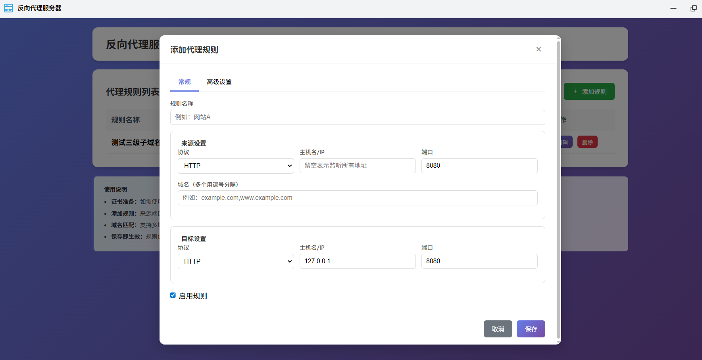

# fn-reverseproxy - 反向代理服务器

轻量级反向代理管理工具，专为飞牛 fnOS 系统设计。采用 Unix Socket 通信，无需占用额外 TCP 端口即可安全访问管理界面。



## 项目结构

```
fn-reverseproxy/
├── cmd/                          # 生命周期管理脚本
│   ├── main                      # 启动/停止/状态管理
│   ├── install_init / install_callback     # 安装流程
│   ├── uninstall_init / uninstall_callback # 卸载流程
│   ├── config_init / config_callback       # 配置变更回调
│   └── upgrade_init / upgrade_callback     # 更新流程
├── config/
│   ├── privilege                 # 应用权限配置（非 root 运行）
│   └── resource                  # 应用资源配置
├── wizard/                       # 安装/配置/卸载向导
├── app/
│   ├── server/                   # 后端服务（Go 编译产物 + 源码）
│   │   ├── reverseproxy          # 编译后的二进制程序
│   │   ├── config/               # 配置管理模块
│   │   ├── api/                  # RESTful API 接口
│   │   └── proxy/                # 反向代理核心引擎
│   ├── www/                      # Web 管理界面
│   │   └── index.html            # 单页面管理界面
│   └── ui/
│       ├── index.cgi             # CGI 网关（Unix Socket 代理 + 静态文件服务）
│       └── images/               # UI 图标资源
├── manifest                      # 应用清单（版本、描述、依赖等）
├── ICON.PNG / ICON_256.PNG / ICON_64.PNG  # 应用图标
└── README.md                     # 本文件
```

## 功能特性

- **域名路由** — 根据请求域名自动分发到不同后端服务
- **多端口监听** — 支持同时监听多个 HTTP/HTTPS 端口，每条规则独立配置
- **SSL/TLS 自动发现** — 自动从飞牛 OS 证书管理中获取并匹配域名证书
- **通配符证书支持** — 支持 `*.example.com` 等通配符证书自动匹配
- **SNI 多域名** — 同一 HTTPS 端口通过 SNI 区分多个域名
- **动态规则管理** — Web 界面可视化操作，保存即生效，无需重启
- **规则校验** — 名称唯一性检测、端口冲突检测，前后端双重校验保障数据一致性
- **HSTS 支持** — 可选强制浏览器仅使用 HTTPS 访问
- **主机头保留** — 可选转发原始 Host 头至后端
- **Unix Socket 通信** — 管理 API 仅通过 Unix Socket 暴露，不占用 TCP 端口

## 架构说明

```
用户浏览器
    │
    ▼ (桌面图标打开)
index.cgi (CGI 网关)
    ├── 静态文件: 直接返回 index.html
    └── API 请求: 通过 Unix Socket 转发
            │
            ▼
reverseproxy (Go 后端)
    ├── /api/proxies      GET    — 获取所有代理规则
    ├── /api/proxies      POST   — 新增代理规则（含校验）
    ├── /api/proxies/:id  PUT    — 编辑代理规则（含校验）
    ├── /api/proxies/:id  DELETE — 删除代理规则
    └── /api/proxies/:id/reload POST — 手动重载代理引擎
```

### 通信方式

| 方式 | 地址 | 说明 |
|:-----|:-----|:-----|
| Unix Socket（主要） | `/vol1/@appdata/fn-reverseproxy/reverseproxy.sock` | 安全、无端口占用 |
| TCP 端口 | 已移除 | 不再使用 |

### 数据目录

| 路径 | 说明 |
|:-----|:-----|
| `/vol1/@appdata/fn-reverseproxy/` | 数据根目录 |
| `config.json` | 代理规则配置（JSON 格式） |
| `config.json.bak` | 配置备份（更新/保存时自动创建） |
| `reverseproxy.sock` | Unix Socket 文件 |
| `info.log` | 运行日志 |

## 使用指南

### 1. 准备证书

在飞牛 OS 的「系统设置 → 证书管理」中添加您域名的 SSL/TLS 证书。反向代理会自动根据规则中的域名匹配合适的证书。

### 2. 添加代理规则

在 Web 管理界面中点击「添加规则」，填写以下信息：

| 字段 | 说明 | 示例 |
|:-----|:-----|:-----|
| 规则名称 | 用于标识该规则的唯一名称 | 我的网站 |
| 来源协议 | 对外提供服务的协议 | HTTP 或 HTTPS |
| 来源端口 | 对外监听的端口号 | 80, 443, 8080 等 |
| 来源域名 | 匹配的域名（多个用逗号分隔） | example.com, www.example.com |
| 目标协议 | 转发到后端的协议 | HTTP 或 HTTPS |
| 目标地址 | 后端服务的 IP 或域名 | 192.168.1.100 |
| 目标端口 | 后端服务监听的端口 | 3000, 8080 等 |

### 3. 校验规则

- 规则名称不能重复
- 相同协议+相同端口只能被一条规则使用（避免 Listener 冲突）
- 端口范围限制为 1-65535

## 构建

```powershell
# 1. 编译 Go 后端（Linux amd64）
cd fn-reverseproxy/app/server
set GOOS=linux
set GOARCH=amd64
go mod tidy
go build -v -ldflags="-s -w" -o reverseproxy

# 2. 打包应用
cd D:\UGit\fn_fpk_packages
.\fnpack.exe build -d .\fn-reverseproxy

# 输出: fn-reverseproxy.fpk
```

## 版本历史

### 更新v1.0.8
- 1、修复代理精准度（解决丢状态码和丢协议的问题）和 吞吐性能（高并发承载能力）瓶颈。（偶发场景）

### 更新v1.0.7
- 1、修复HSTS实际未生效问题
- 2、新增高级设置）：最大上传限制（MB）、自定义请求头 (Custom Headers)、强制跳转 HTTPS、IP 访问控制 (Access Control)

## 许可证

本项目为第三方飞牛 OS 应用，仅供学习交流使用。
