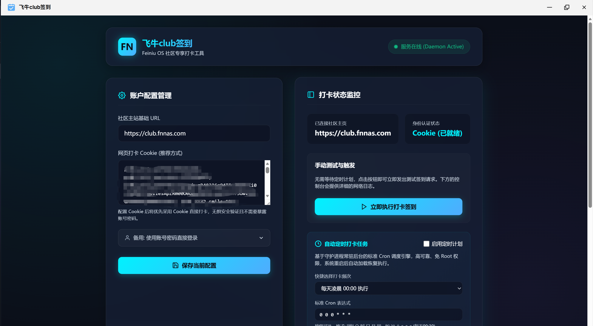

# 飞牛 Club 自动签到工具 (fnosnassign)

[](https://www.fnnas.com/)
[](#免责声明与许可条款)
[](https://go.dev/)
[](#系统架构与跨平台编译)

`fnosnassign` 是一款专门为 **飞牛私有云（Feiniu OS / FNOS）** 用户量身定制的飞牛社区（[club.fnnas.com](https://club.fnnas.com)）自动打卡签到工具。它深度融入飞牛 OS 的三方应用生态，提供**网页 Cookie**和**账号密码**双重认证方案，支持每日定时自动签到及高能实时日志输出，让您的飞牛社区经验值稳步增长。

---

## 🌟 核心特性

*   **✨ 极简视觉设计**：基于现代精美暗黑科技主题打造，融入毛玻璃（Glassmorphism）质感与高能流光渐变色彩，拥有自适应布局（自如应对 PC、平板与手机移动端屏幕尺寸）。
*   **🔑 双重认证机制**：
    *   **Cookie 快捷配置（首选推荐）**：无需保存明文账号与密码，仅需填入浏览器抓取的登录 Cookie 即可实现打卡，避开高强度滑动验证，安全性极佳。
    *   **账号密码自动登录（备用方案）**：支持常规账号密码，后台自动处理 Discuz! 登录协议，内置 FormHash/LoginHash 动态抓取与 GBK 简中转码逻辑。
*   **⏰ 高可靠后台常驻（守护协程）**：内建纯 Go 语言编写的轻量 Cron 计划任务调度引擎。支持标准的 Linux 5 字段 Cron 及高精度的 6 字段秒级 Cron 表达式，系统重启或应用升级后，守护进程（Daemon）可自动唤醒并恢复定时任务，**100% 自动运行，无需人工干预**。
*   **💻 实时流控制台 & 历史日志追溯**：
    *   **手动测试打卡**：支持在管理面板一键触发手动打卡测试。
    *   **实时控制台（Chunked Stream）**：前端打卡日志采用 HTTP Chunked 实时流式传输技术，打卡步骤如丝般顺滑地流式呈现在终端中。
    *   **历史日志存储**：自动持久化存储最近打卡的历史运行日志，随时可在前端切换追溯。

---

## 📸 界面预览

本应用管理面板设计精美，能够极好地融入飞牛 OS 的桌面风格：

> [!NOTE]
> 界面预览图片保存在仓库中的 [Preview/1.png](Preview/1.png)。



---

## 🛠️ 技术架构与工作原理

`fnosnassign` 采用了经典且健壮的 **前功后守（前后端分离 + 守护进程）** 架构设计：

```mermaid
graph TD
    subgraph 飞牛私有云宿主机 (FNOS Host)
        CGI[FNOS CGI 代理 Web 服务] -->|Unix Domain Socket| Sock[fnosnassign.sock]
        
        subgraph FNOS 三方应用沙盒
            direction TB
            Frontend[Vanilla UI 网页端<br>www/index.html] <-->|HTTP API 请求| CGI
            
            subgraph Go 后端常驻服务 (Daemon)
                Sock <--> Router[HTTP 路由多路复用器]
                Router <--> API_Config[/api/config<br>配置读写]
                Router <--> API_Sign[/api/sign<br>手动签到流]
                Router <--> API_Logs[/api/logs<br>日志拉取]
                
                Cron[内建 Cron 调度协程] -->|定时触发| Task[Discuz! 签到核心逻辑]
                API_Sign -->|手动触发| Task
                
                Task -->|模拟请求| TargetBBS[飞牛 Club 社区论坛<br>club.fnnas.com]
                Task -->|追加记录| LogFile[(info.log)]
                API_Config -->|持久化| ConfigFile[(config.yaml)]
                ConfigFile -->|加载配置| Cron
            end
        end
    end
```

### 1. 前端实现 (`app/www`)
*   **单 HTML 极简设计**：整个前端应用仅由一个 50KB 左右的 `index.html` 构成，无繁重框架依赖，轻量快速，加载几乎瞬间完成。
*   **现代原生 CSS 变量**：采用现代 CSS 自定义变量系统（`:root`），配合 `backdrop-filter` 实现了极具视觉冲击力的毛玻璃质感面板、呼吸灯态与高饱和色彩流光边框。
*   **HTTP 数据流（Chunked Stream）交互**：当手动触发打卡时，利用 `fetch` 接口读取后台实时吐出的 Chunked 字符流，让后台的每个网络包、每个请求步骤（如 `获取登录页...` -> `找到formhash...` -> `登录成功！`）都能零延迟地呈现在前端控制台。

### 2. 后端服务 (`serverSourceCode`)
*   **高效语言选型**：使用 Go 语言开发，充分发挥其高并发协程、极小内存占用（静态编译后常驻内存仅需几 MB）与强韧的单文件分发特性。
*   **Discuz! 签到业务层**：
    *   通过 `golang.org/x/text` 对 Discuz! 网页默认的 GBK (Simplified Chinese) 编码进行编解码转换，防止网页提示、签到状态返回中文乱码。
    *   基于 `github.com/PuerkitoBio/goquery` HTML 分析库，快速从返回的登录及签到页面中动态嗅探 `formhash`、`loginhash` 等鉴权令牌。
    *   网络引擎自带 `cookiejar`，能完美保持多步重定向过程中的会话 Session，无需额外处理繁琐的 Cookie 存储器。
*   **常驻守护协程 (Cron Daemon)**：在后台无限循环检测 minute-boundary 并配合毫秒级锁，根据解算出来的 Cron 表达式执行自动拉起任务。

### 3. FNOS 周期生命管理 (`cmd`)
本应用遵守飞牛 OS 三方应用标准的包结构及生命周期钩子：
*   **`cmd/main`**：应用的生命周期主控制脚本。当用户在飞牛 OS 桌面点击应用启动或关闭时，FNOS 会派发 `start`、`stop`、`status` 等指令给该脚本。
    *   **架构自适应判定**：在 `start` 阶段，脚本会通过 `uname -m` 自动判定 FNAS 的 CPU 架构（如英特尔/AMD x86_64、群晖/飞牛同款的 ARM64 架构），自动选用对应架构的编译二进制包启动。
    *   **无特权优雅运行**：服务完全运行在非 Root 安全沙盒用户下，采用守护进程挂载 `-sock` 到 `var/fnosnassign.sock`。
*   **`cmd/install_callback` 与 `cmd/uninstall_callback`**：负责部署在 FNAS 持久卷数据目录 `var`（FNOS 参数 `TRIM_PKGVAR`），确保升级应用时用户的打卡配置 `config.yaml` 与签到日志 `info.log` 完好无损保留。

---

## 🏗️ 编译与打包指南

如果您想自行修改代码并进行二次编译，请参照以下指南：

### 1. 宿主机环境要求
*   安装有 **Go 1.20 或更高版本** 的开发环境。
*   拥有 **Bash 运行环境**（Linux / macOS / Windows Git Bash均可）。

### 2. 自动化一键打包
项目根目录下存放有 `build_fpk_to_this_dir.sh` 构建脚本，它承载了编译、版本升级与 FNOS 打包的全套流水线：

```bash
# 赋予脚本执行权限（若在 Windows 下直接在 Git Bash 中运行即可）
chmod +x ./build_fpk_to_this_dir.sh

# 运行打包脚本
./build_fpk_to_this_dir.sh
```

**该脚本将依次执行以下流程**：
1.  调用 `serverSourceCode/build_sourceCode.sh` 开启交叉编译，生成 dual-arch 二进制：
    *   `amd64` (x86_64)：`app/server/amd64/fnosnassign_x86_64`
    *   `arm64` (aarch64)：`app/server/arm64/fnosnassign_aarch64`
2.  读取 `manifest` 清单，自动进行版本管理。
3.  自动执行 `fnpack.exe` 对包目录进行格式打包，最终在根目录下生成可直接上传到飞牛私有云（FNOS）应用市场的应用安装包，如：`fnosnassign_all_v1.0.0.fpk`。

---

## 📂 目录结构解析

```text
fn-fnosnassign/
├── .gitignore
├── ICON.PNG                     # 应用列表小图标
├── ICON_256.PNG                 # 应用桌面大图标 (256x256)
├── LICENSE                      # 开源与免责声明协议
├── manifest                     # 飞牛 OS 应用元数据说明清单
├── fnpack.exe                   # 飞牛 OS 官方打包辅助工具
├── build_fpk_to_this_dir.sh     # 一键自动化架构编译与打包发布脚本
├── labels.txt                   # 应用分类标签
│
├── Preview/                     # 预览与文档资源
│   └── 1.png                    # 管理面板界面高清截图
│
├── app/                         # 前端网页资源及编译后的二进制包
│   ├── www/                     # 网页资产
│   │   └── index.html           # 前端 SPA 智能控制台
│   ├── ui/                      # 桌面 UI 定义
│   └── server/                  # 运行时编译产物 (自动同步生成)
│       ├── amd64/               # x86 核心架构执行体
│       │   └── fnosnassign_x86_64
│       └── arm64/               # ARM 核心架构执行体
│           └── fnosnassign_aarch64
│
├── serverSourceCode/            # 后端 Go 源代码仓库
│   ├── main.go                  # 业务主逻辑 (网络打卡、多路 API、Cron调度引擎)
│   ├── config.go                # 核心配置读写加载单元
│   ├── config.yaml              # 测试配置文件
│   ├── build_sourceCode.sh      # 后端双架构跨平台静态编译脚本
│   ├── go.mod / go.sum          # 依赖管理依赖关系表
│   └── server/                  # 编译中转临时目录
│
├── wizard/                      # 飞牛 OS UI向导
│   ├── config                   # 配置步骤定义
│   ├── install                  # 安装提示向导
│   └── uninstall                # 卸载清理向导
│
└── cmd/                         # 飞牛 OS 生命周期钩子接口脚本
    ├── main                     # 服务守护进程启动/停止控制入口 (核心)
    ├── install_callback         # 安装环境修复与预备
    ├── uninstall_callback       # 卸载遗留数据安全清理
    └── upgrade_callback         # 升级资源安全合并与保留
```

---

## 📖 核心配置及配置获取

为了保证签到的极高成功率与数据安全性，强烈建议您优先使用 **网页 Cookie 打卡方式**。

### 1. 如何获取飞牛社区 Cookie ？
1.  电脑浏览器（如 Edge、Chrome 或 Safari）访问：[club.fnnas.com](https://club.fnnas.com/) 并登录您的账号。
2.  登录成功后，按下键盘上的 `F12` 键打开“开发者工具”（Developer Tools）。
3.  切换至 **网络 (Network)** 标签卡，重新刷新一次论坛首页。
4.  在左侧请求列表中随便选择一个论坛的请求，点击右侧的 **标头 (Headers)**，在下方找到 **请求标头 (Request Headers)** 区域中的 `Cookie` 属性。
5.  复制其中包含 `pvRK_2132_saltkey=...` 和 `pvRK_2132_auth=...` 这一整串内容，填入飞牛自动签到控制面板的“网页打卡 Cookie”输入框，并点击“保存当前配置”。

> [!TIP]
> 社区 Cookie 的有效期通常长达数月，能避开各种图形人机验证，极度安全高效。

### 2. 定时计划任务配置
如果您需要修改每日打卡的频率，可以开启“启用定时计划”，并在面板中进行快捷设置：
*   **每天上午 09:30 执行 (强烈推荐)**：`0 30 9 * * *`
*   **每天凌晨 00:00 执行**：`0 0 0 * * *`
*   **每天 12:00 和 20:00 双重保险执行**：`0 0 12,20 * * *`
*   **自定义高级 Cron**：可在选择框内切换为“自定义高级 Cron 表达式”进行输入，完全兼容 Linux Crontab 标准语法。

---

## 🛡️ 免责声明与许可条款

1.  本应用（`fnosnassign`）为开源学习研究 Discuz! 协议的辅助打卡工具，**仅用于签到打卡，严禁用于任何非法用途**。
2.  **本应用禁止商用**。任何组织与个人不得将此工程包装成付费产品或增值服务进行售卖。
3.  使用本软件所造成的任何社区封号、账户异常、宿主机运行故障或隐私损失，由使用者自行承担，软件开发者 Laok 不承担任何法律责任。
