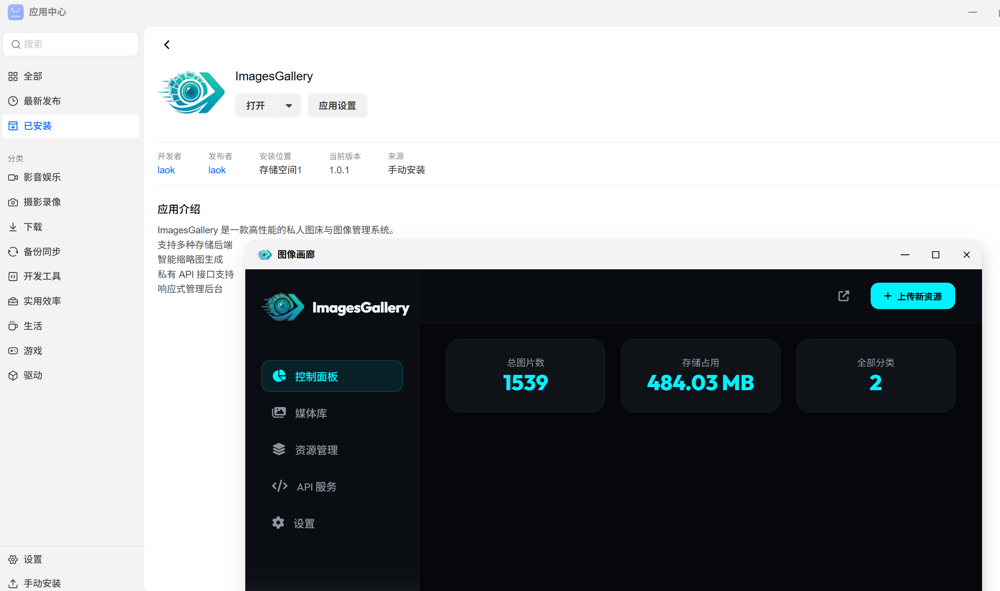
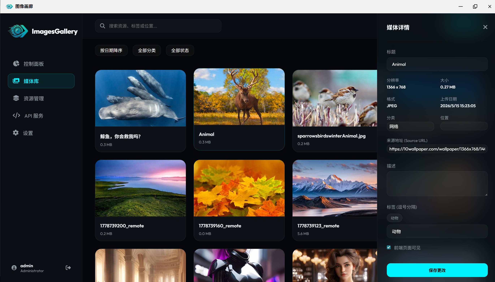
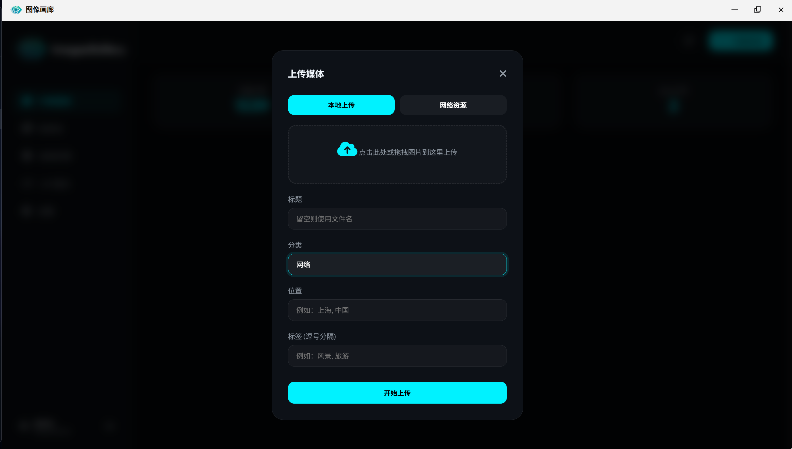
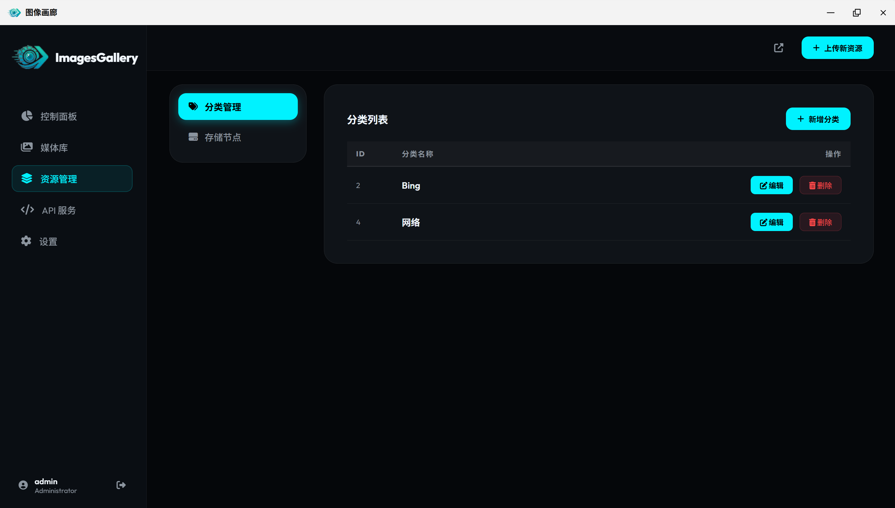
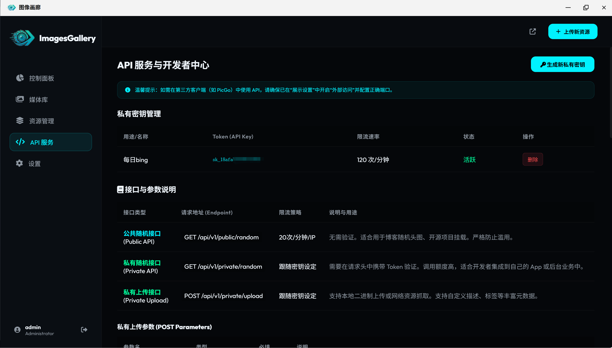
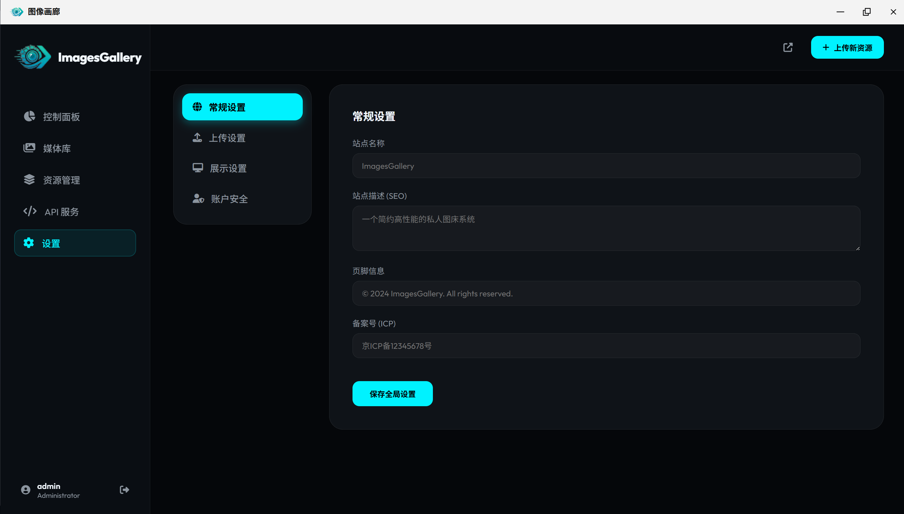

# ImagesGallery - 高性能私人图床与图像管理系统

ImagesGallery 是一款专为个人和团队设计的现代化、高性能私人图床与图像管理解决方案。它不仅提供美观的界面，还具备强大的后端支撑，旨在简化图像的存储、管理与分享流程。

## 🌟 核心功能

### 1. 媒体库管理
提供直观的可视化界面，支持对海量图片进行快速预览、分类与检索。智能缩略图技术确保在低带宽环境下也能流畅浏览。

### 2. 多渠道媒体上传
支持拖拽上传、批量上传以及通过 API 进行远程上传。系统会自动处理图像格式转换与压缩，优化存储空间。

### 3. 灵活的资源管理
支持多种存储后端（如本地存储、云存储等），您可以根据需求灵活配置不同的资源池。

### 4. 私有 API 服务
提供完善的 API 接口，方便集成到第三方应用（如 Typora, PicGo 等）或自定义工作流中，实现自动化的图片分发。

### 5. 响应式管理后台
基于现代 Web 技术开发，完美适配桌面端与移动端，随时随地管理您的个人媒体库。

### 6. 系统深度设置
高度可定制化的系统设置，包括上传限制、权限控制、存储策略以及网络配置等。

---

## 🖼️ 应用截图预览

*注：以下截图位于本目录下*

- **系统主页**: 
- **媒体库**: 
- **媒体上传**: 
- **资源管理**: 
- **API 服务**: 
- **系统设置**: 

---

## 👤 项目信息

- **项目名称**: ImagesGallery
- **作者**: laok
- **联系方式**: kuai410022283@qq.com
- **维护地址**: [GitHub - Brian099/ImageAdmin](https://github.com/Brian099/fn-ImageAdmin)
